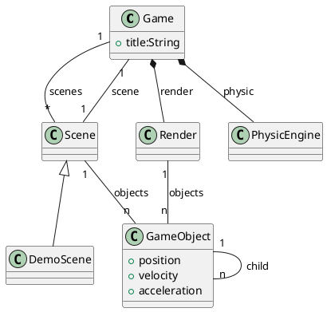
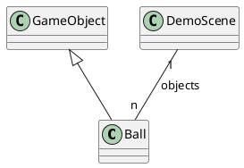

# README

## A Javascript Project

This sample code explain how implement basic classes to create minimal framework for a 2D game.


_fig. 1 - A Good Class diagram is better than any word ;)_

To be added soon :




## Build

To build this sample:

```shell
$> npm build
```

## Run

Two options:

1. just open your favorite web browser on the index.html file, and enjoy

```shell
$> firefox ./index.html
```

2. run the project into a dev server with interactive reload:

```shell
$> npm run dev
```

That's All

McG.
