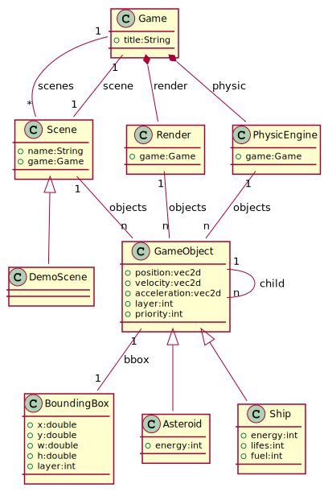

# README


## A Javascript Project

This sample code explain how implement basic classes to create minimal framework for a 2D game.



_fig. 1 - A Good Class diagram is better than any word ;)_

And the target Scene game diagram, containing all futur Scene implmentation for all screen in the game, from title to play scene.


_fig. 2 - The Scene game diagram where all the secret target is exposed_

## Build

To build this sample:

```shell
$> yarn build
```

## Run

1. run the project into a dev server with interactive reload:

```shell
$> yarn start
```

2. just open your favorite web browser on the index.html file, and enjoy

```shell
$> firefox http://localhost:1234
```

3. Right now, only some basic tests for the internal framework/engine are possible:

- <kbd>Up</kbd>,<kbd>Down</kbd>,<kbd>Left</kbd>,<kbd>Right</kbd> to move the Player object (rectangle),
- <kbd>D</kbd> debug mode from 0, nodebug to 6 max level debug visual info (default set to 2),
- <kbd>PageUp</kbd> add 10 balls to the display,
- <kbd>PageDown</kbd> remove 10 balls from the display,
- <kbd>Backspace</kbd> remove all objects but player,
- <kbd>R</kbd> reset all displayed ball to a random position with random velocity and phyusic attributes (mass, friction, elasticity).

That's All

McG.
