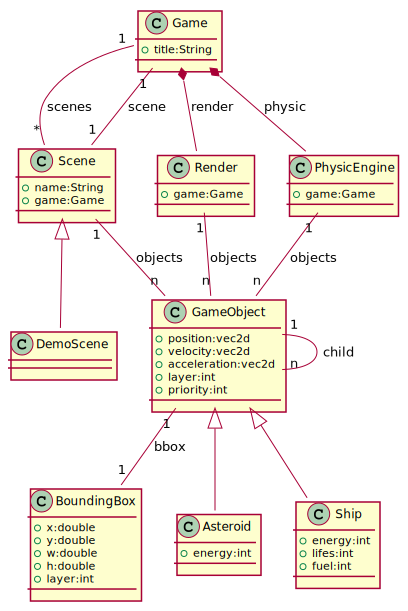
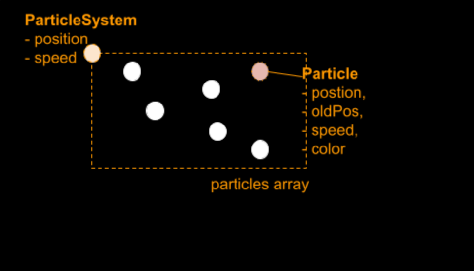
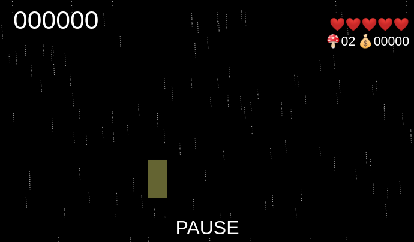

# UFO, Unknown Framework Object | A JavaScript 2D game oriented framework
2020-2021, by Frédéric Delorme.

## Revision

| Version | Date        | Author           | What’s new ?      |
| ------- | ----------- | ---------------- | ----------------- |
| 0.0.1   | 28-NOV-2020 | Frédéric Delorme | Document Creation |
| 0.0.2   | 14-DEC-2020 | Frédéric Delorme | Add               |
| 0.0.3   | 29-JAN-2021 | Frédéric Delorme |                   |

## Introduction

This small doc intends to explain what is build there ans what todo with.

Tools and references used to achieve this project

- https://www.planttext.com/
- https://wiki.developer.mozilla.org/en-US/docs/Web/API/CanvasRenderingContext2D

## Table of content

- [UFO, Unknown Framework Object | A JavaScript 2D game oriented framework](#ufo-unknown-framework-object--a-javascript-2d-game-oriented-framework)
  - [Revision](#revision)
  - [Introduction](#introduction)
  - [Table of content](#table-of-content)
  - [Introduction](#introduction-1)
  - [Basic Javascript framework](#basic-javascript-framework)
  - [The Main page](#the-main-page)
  - [The JavaScript main.mjs](#the-javascript-mainmjs)
  - [The classes of the game](#the-classes-of-the-game)
    - [A bit of History](#a-bit-of-history)
    - [The Game LOOP](#the-game-loop)
  - [Some Scene](#some-scene)
    - [A GameObject to play with](#a-gameobject-to-play-with)
  - [Rendering all of them](#rendering-all-of-them)
    - [Layer](#layer)
    - [Managing objects](#managing-objects)
    - [draw !](#draw-)
  - [Another point of view](#another-point-of-view)
    - [Camera and Viewport](#camera-and-viewport)
    - [Scene](#scene)
    - [Render with Camera](#render-with-camera)
  - [Fun with Particles](#fun-with-particles)
    - [Goal](#goal)
    - [An elementary Particle](#an-elementary-particle)
    - [Particle System](#particle-system)
      - [Initialization](#initialization)
      - [Create and update](#create-and-update)
      - [Update](#update)
    - [Draw particles](#draw-particles)
  - [Annexes](#annexes)
    - [Gamepad API integration](#gamepad-api-integration)
      - [Detect devices](#detect-devices)
      - [Detect button events](#detect-button-events)
      - [Identify `UserPlayer`](#identify-userplayer)
      - [Connect `Game`](#connect-game)
      - [Connect `Scene`](#connect-scene)

## Introduction

This is a little overview of what can be a 2D game based on the javascript language. You will find all the code at [https://github.com/mcgivrer/ufo](https://github.com/mcgivrer/ufo).
The project is developed by myself, and you could contact me for any question at [https://gitter.im/SnapGames/ufo](https://gitter.im/SnapGames/ufo).

>**NOTE**
>You will need to know how to code classes and modules with javascript, but you won’t need to know anything about game development.


## Basic Javascript framework

To start with our new javascript game, we will need some basic knowledge about how to interface UI and input with our game. With some clearer purposes, how to interact between the gamer and the screen.

Some information about this small project. The structure of the project is as below:

```text
ufo/
|_ docs/
|  |_ illustrations/
|  |_ images/
|_ modules/
|  |_ core/
|  |_ demo/
|  |_ game/
|  |_ utils/
|_ styles/
|_ index.html
|_ README.md
|_ LICENSE
|_ package.json
```

_illustration 1 - The Project directory structure._

Javascript files are saved into the modules folder, the css file is stored into the styles folder. `index.html` is the entry point for our project, and the package.json defines some development resources.
You will also find the traditional `README.md` and `LICENSE` files.
The first thing to study is the index.html file, where any web project starts from.

A Story to build a game with.
The story we talk about is the scenario of the game. Simple.

You are an UFO and need to collect samples from planets to examine and study species from outer space.

From a space map, you navigate through some star system, detect planets and collect samples and species from populated planets.

There will be 3 kind of gameplay:

1. use the space map to discover star system,
2. navigate to identified star system planets through asteroids field,
3. collect samples and species by teleporting them into your spaceship (UFO)

But you will have to add something to your mission: collect fuel to keep your spaceship up and run, and fill some discoveries to achieve missions and earn space money.

Here is the screen map of the game, as a development guide to, step by step, build the game.



*illustration 2 - The Game map where all screens appear.*

All those screens will be developed in this small project.
But to realize such a game, we need some basic elements, a basement for all the code we need to create.
Here is a small overview of the classes we will manage in this javascript framework.



_illustration 3 - The class diagram for our minimalistic game framework._

## The Main page

So first, to display things in a JavaScript game, we first need a basic HTML page where to host our code.
Let’s go to basic a create a good old `index.html` page:

```html
<html lang="en">
  <head>
    <meta charset="UTF-8">
    <meta name="viewport" 
          content="width=device-width, initial-scale=1.0">
    <link rel="stylesheet" 
          type="text/css" 
          href="styles/main.css">
    <title>UFO</title>
  </head>
  <body>
    <canvas id="ufo"></canvas>
    <script type="module" src="./modules/main.mjs"></script>
  </body>
</html>
```

_illustration 1 - the entry point: index.html_

A little bit of structure explanation. The `index.html` page, is a brave default piece of HTML.
The header will contain all not displayed information, let’s talk about metadata about the page, and the body will describe the visible part. from title to text and images in a standard page.
The header in our index page will define the title of the page with the `<title\>` tag, and set a default CSS file where to define global styles of rendering for any text or other visual tag in our page. this file will be the `styles/main.css` file. it will reset some default  behaviors of the browser and set some values for our own needs. we will dig with detail those css commands later.

## The JavaScript main.mjs

The `main.mjs` file is a JavaScript module to start the `Game` object and request a frame update to the browser to call with constant frequency to update the game. This will call our game loop, through the `Game#update()` method.

```javascript
import {Game} from './game.mjs';
let start=0;
let game = new Game("ufo");
game.run();
requestAnimationFrame(step);
 function step(timestamp) {
  var progress;
  if (start === null) start = timestamp;
  progress = timestamp - start;
  game.update(progress)
  requestAnimationFrame(step);
}
```

_illustration 2 - code extract from file main.mjs_

So the main class `Game` is where all the things happened.

## The classes of the game

### A bit of History

Before diving in the Game development, we need to know some foundation of game development, and particularly on how to let graphical objects interact with humans !

In any game, there is a central process, inherited from ancestral games (maybe I am exaggerating a little bit ?) : The Game Loop.
in some very old video game, the manner to build the gale was directly linked to the involved display hardware !

The display screen, in those old times, was relying on the CRT electronic process to produce images.
an electron beam was electromagnetically controlled to irradiate a phosphorescent material to illuminate screen pixels, all of this in a bubble glass.

<a href="http://csis.pace.edu/~marchese/CG/Lect2/Lecture_2a.html" title="Go to visit diagram original page">
</a>

_This is a Electron Beam into a CRT screen_

<a href="https://www.wired.com/2016/03/a-hackers-guide-to-bending-the-universe/"></a>

_A bubble armed glass of a CRT_


The electron beam swiped the entire phosphorescent screen to draw all lines of an image, and I won’t go through the different image size standard (PAL, SECAM, NTSC, etc…) but during the time the beam back to upper top screen, the electron gun is disabled, and this time, between each image (25/s or 30/s, depending on those standards) is the one used by a computer to redraw all the image before display. so, 1s/25 images results of 40ms to compute and draw everything (in the best case).
So, the Game loop frequency is based on those 40 ms cycles.

And during this cycle, not only drawing operations are performed, all moves, input red, are done.

[](https://gameprogrammingpatterns.com/game-loop.html "Go to read the fantastic book on Game development pattern !")
_The most basic game loop diagram_

And to keep animation pace at a constant level, we will wait a little bit at the end of cycle to start redrawing at the exact right time, during the end of beam back move.

So the game loop is like the following simplified algorithm:

```java
loop(){
  while(!exit()){
    time = currentTimeMillis()
    elapsed = time - previous 
    input()
    update(elapsed)
    draw()
    wait(40-elapsed)
    previous = time
  }
}
```

But as we are on the javascript platform, the default web browser API provides a good part of this loop through the requestAnimationFrame() method.

### The Game LOOP

As we’ve just touched 2 words about in the previous section, the game loop is where all things happened in a game. It will analyze user (gamer) input on keyboard, mouse or, why not gamepad, and compute corresponding action and changes on all the game, and finally, render all the game screen.

In our case, playing with a JavaScript program, we are forced to interact with a web browser and all the web entropy. the screen will be an HTML component where our program will intercept user interaction and display objects and colors into it.

The `<canvas/>` tag is the open door to all the needed technology we need to detect user or environment action, display 2D or 3D graphics, with some fancy tricks to draw with WebGL, a power interface to advanced graphics capabilities.

But the `Game` class itself only needs to manage the main loop.
The only way to request the browser to integrate the draw of our game with the web page rendering.  This will be achieved by calling the `requestAnimationFrame` function.

In the `main.mjs` file:

```javascript
function step(timestamp) {
  var progress;
  if (start === null) start = timestamp;
  progress = timestamp - start;
  game.update(progress)
  requestAnimationFrame(step);
}
```

_Illustration 3 - the Step method connecting web API with our game._

The step function links the `Game#update()` with the `requestAnimationFrame()`. So, let’s go and discover the `Game` class.

```javascript
class Game {
    constructor(canvasId) { }
    init(){ }
    resizeCanvas() { }
    keyPressed(e){ }
    keyReleased(e){ }  
    update(elapsed) { }
    run() { }
  }
export {Game};
```

_illustration 4 - The Game class, where all begin._

The first method called from `main.mjs` is the `Game` constructor. This where all the dependencies and services needed by our game will be initialized:

```javascript
constructor(canvasId) {
  this.canvas = document.getElementById(canvasId);
  window.addEventListener('keydown',
    this.keyPressed.bind(this),false);
  window.addEventListener('keyup',
    this.keyReleased.bind(this),false);
  window.addEventListener('resize',
    this.resizeCanvas.bind(this),false);

  this.scenes = [new DemoScene(this)]
  this.scene  = this.scenes[0]
  this.debug  = 0
  this.pause = false
      
  this.stageConfig = {
    width: window.innerWidth,
    height: window.innerHeight,
  };
  this.canvas.width = this.stageConfig.width
  this.canvas.height = this.stageConfig.height

  this.render = new Render(this, this.canvas)
  this.physic = new PhysicEngine(this)
  this.lastTime  = 0
  this.update()
}
```

_illustration 5 - The constructor to rule them all._

First, we retrieve the canvas in the index.html page by its tag identifier.
Then, we link some JavaScript events to our code: `keydown`, `keyup` and `resize`. These events are, by apparition order, keyboard keys events, `keyup` and `keydown`,  and the window resize event.

And then, initialize some class internal attributes, we will go deeper in those attributes later, and we set the canvas size.

Finally, we initialize our future `Render` and the `PhysicEngine` services. The first one is the service to draw things to the screen, and the second one, will maintain some physic mechanic’s attributes to animate the game objects.

The `Game#run()` is called by the `main.mjs` to initialize the first `Scene`, and then start updating things.

```javascript
run() {
  this.init()
  this.update()
}
```

_illustration 5 - Run the game !_

Then a first call to `update()` will start the game mechanics.

Now we know how to start, we need to understand what is this Scene class ?

## Some Scene

The `Scene` is a way for the `Game` where some behaviors are defined. Let’s explain this.

When you start the game, there is always a title screen, you have to click a button and then see the main game menu screen, where you have to choose to start the game, or see and modify some settings, or load a previous saved game. Finally, you click on the start entry, and go to the play screen.

All those defined parts of the game with specific behavior, specific context, are Scene.

The Scene is a class where all the step of your game, for a specific context are managed.

We will find the init, update and some specific event listeners to react on `keyup`, `keydown` events, and then define some processing.

The file scene.mjs contains the following code:

```javascript
class Scene{
    constructor(g){}
    add(o){}
    init(){}
    keyPressed(e){}
    keyReleased(e){}
    update(elapsed){}
    draw(render,elapsed,startTime){}
}
export {Scene};
```

_illustration 7 - The Scene class, to add some game screen._

The `constructor(g)` receives only one parameter, the parent `game` object the `Scene` instance belongs to. It also initialises the `objects` list of GameObject the Scene will support and manage.

```javascript
constructor(g){
    this.game = g;
    this.objects = []
}
```

_illustration 8 - Initialize a Scene_

The `add(o)` method is a helper to add a `GameObject` to the `Scene`.

```javascript
add(o){
  this.objects.push(o)
  this.objects.sort((o1,o2)=>{
    return o1.layer>o2.layer?1:-1
  })
  this.game.render.add(o)
}
```

_illustration 9 - Add a GameObject to the Scene_

The `GameObject` is added to the `objects` list and the objects list is sorted regarding the `GameObject.layer` attribute.
This particular attribute will be used by the Render service to draw the object on the right depth level.

And then, the object is added to the render pipeline.
The following event listener are needed to process `keyup` and `keydown`:

```javascript
keyPressed(e){ }
keyReleased(e){ }
```

_illustration 10 - Proceed with keyboard events._

You will be able to process keyboard key pressed and released, and manage actions on your `Scene` objects.
The update method is where objects of your scene will be modified in their behaviors.

```javascript
update(elapsed){ }
```

_illustration 11 - the update for this scene._

And the last but clearly the not least, the draw method, where scene’s objects are rendered to the screen of your web browser.

```javascript
draw(render,elapsed,startTime){
  render.draw(elapsed,startTime)
}
```

_illustration 12 - Draw all the scene’s objects_

The rendering process, as we already talk a little bit before, is delegated to the Render class game’s instance.

The render parameter is this instance, elapsed and startTime are some time values that can help in certain complexe rendering cases to compute time based drawings.

Now that we know all about the Scene, we must go and dive into the GameObject.

### A GameObject to play with

The `GameObject`, is an object for the game (sic). This component is for example a sprite, a displayed text, bullet, a bouncing ball, a map, so, you understand, all this kind of visual things.

The `Scene` and the `Render` class are the host for this object.
But let’s analyze this class, see the `gameobject.mjs`:

```javascript
class GameObject {
  constructor(name,p,v,s) {
    this.name=name
    this.position = p
    this.size = s
    this.velocity = v
    this.acceleration = {x:0,y:0}
    this.color='red'
    this.isConstrainedToWindow = true
    this.layer=1
    this.priority=1

    this.properties = {
      elasticity: 1.0,
      rugosity: 1.0,
      mass:1.0
    }
    this.contact=false;
  }
  draw(c) {
    c.save()
    c.beginPath()
    c.arc(this.position.x, this.position.y, 
      this.size.width, 0, Math.PI * 2, false)
    c.fillStyle = this.color
    c.fill()
    c.closePath()
    c.restore()
  }
  update(elapsed) {
  }
}
export {GameObject};
```

_illustration 13 - The GameObject, the heart of our game._

In the `constructor(name, p, v, s)` all the `GameObject` attributes are initialized with method parameters values or with default values.

A traditional `name`, a key to find an object in the rendering pipeline or in the scene, `p` is a 2D vector position, `v` is a 2D vector for velocity, and `s` is a 2D vector  to define the `GameObject` size.

the other attributes are speakitself:

```javascript
    this.color='red'
```

The next ones are for rendering pipeline in the `Render` class:

```javascript
    this.layer=1
    this.priority=1
```

The properties are the physic engine’s attributes for the `GameObject`, the `acceleration`, and some special characteristics about the `elasticity`, `rugosity` and `mass`.

```javascript
    this.acceleration = {x:0,y:0}
    this.properties = {
      elasticity: 1.0,
      rugosity: 1.0,
      mass:1.0
    }
```

The last ones are for collision management.

```javascript
    this.contact=false;
    this.isConstrainedToWindow = true
```

These attributes will be also used for `PhysicsEngine` mechanics computation and collision reaction.

## Rendering all of them

The draw of the `objects` is delegated to the `Render` class. Let's have a look at this class.

```javascript
class Render {
    constructor(game, canvas) {
        this.game    = game
        this.canvas  = canvas
        this.ctx     = canvas.getContext("2d")
        this.objects = []
        this.layers  = []
        this.layersMap = new Map()
    }
    add(object) { }
    remove(object) { }
    removeAll(){ }
    clear(){ }
    draw(elapsed,startTime) { }
    drawDebugLineInfo(elapsed,startTime){ }
    drawPause(){ }
    resize(stageConfig){ }
}
export {Render}
```

_illustration 14 - The Render class_

First, as for any other class, we have a constructor initializing numerous attributes. one is very important, it is the canvas context, the API needed to draw anything on the canvas. As we are building a 2D game, we will play with the 2D version of the API.

```javascript
this.ctx     = canvas.getContext("2d")
```

Three others attributes are mandatory:

```javascript
this.objects = []
this.layers  = []
this.layersMap = new Map()
```

`objects`, `layers` and layersMap are the rendering object pipeline.

- while `objects` maintains the list of known objects, layers and layersMap are the collection used to render all object in a sort manner to manage depth of rendering order athrough some `Layer`.

A layer has an index order and a list of sorted objects.

### Layer

The class Layer is a useful piece of POJO (where POJO=Plain Old Javascript Object) to be easily managed into the pipeline:

```javascript
class Layer {
    constructor(index) {
        this.index = index
        this.objects = []
    }
    sort() {
        this.objects.sort((o1, o2) => {
            return (o1.priority > o2.priority ? 1 : -1)
        })
    }
}
```
As described just before, this class has 2 attributes, a index, a number in the rendering pipeline and an identifier used into all GameObject (see layer attribute) to be displayed on the same plane, and the resulting  object list.

### Managing objects

The Render class propose some helpers to add or remove objects into/frol the pipeline. 

- `add(GameObject)` will add a gameobject to the objects list and into the right Layer. Is no layer with the requestinindex exists, it will be created and added to the layer map and the layer list.
- `remove(GameObject)` will remove the corresponding object from the objects list, and from the layer.  If the corresponding layer is empty, it will be destroyed.
- `removeAll()` will remove all objects from the rendering pipeline by reseting objects and layer list and renewing the layer map.


_illustration 16 - The Render model_

### draw !

If we go into the draw() details, the processing of all the GmaeoJect to rendereder is a quick and fast loop:

```javascript
draw(elapsed,startTime) {

  this.clear()

  // Display all objects
  if(this.layers.length>0){
    this.layers.forEach(layer => {
        layer.objects.forEach(o => {
            if(o.active && (o.duration>0||o.duration==-999)){
                o.draw(this.ctx)
            }
        })
    })
  }
  ...
}
```

_illustration xx - The drawing operation for all those `GameObjects`'s_

First, a full clear of the rendering area before drawing all. Then, looping on all the layers to draw all their contained objects with the `GameObject.draw(context)` method.

> _**NOTE**_
> A little trick here is used to know if the object must be rendered: test if object is active, and if its life duration is upper than `0`, or render it is the duration is `-999`.

There is also a large part of the code we wil not explored, because it is only dedicated to the debug display, and in a normal use of this framework, it is not taking part in the rendering process.

You just need to know that, if debug mode is activated globaly on the game class (see attribute `Game.debug`), and `debug > 2`, some attributes of each objects are displayed during the rendering, reducing drastically global rendergin performance(particularly on the firefox browser, having a clear issue on the usage of 2D Canvas `strokeText` method [^1].

If `debug > 0`, a simple line at bottom of screen show some basic debug information.

## Another point of view

As in many game, you certainly seen that the screen display follow the main character, or some specific action needing the player focus. To achieve such mechanism, developers use a common trick, like in movie, it's a `Camera` !

### Camera and Viewport

The magic mechanism consists in having a new `GameObject`, following a target, another `GameObject`, with a small delay on the following action.

A simple formula to produce the required effect: the position of the camera if following a target `GameObject`, centered in the viewport, and with a little delay trough the `tween` factor.

```javascript
    x += ((target.x + target.width - viewport.width * 0.5f) - x) * tween * elapsed;
    y += ((target.y + target.height - viewport.height * 0.5f) - y) * tween * elapsed;
```
_illustration 17 - The secret computation of camera position_

The Camera object will be very simple with draw and update overloaded :

```javascript
class Camera extends GameObject{
    constructor(name, tween, target, viewport){
        super(name)
        this.tween = tween
        this.target = target
        this.viewport = viewport
        this.size = viewport
    }

    update(elapsed){
        this.position.x += 
          ((target.position.x + target.size.width - this.viewport.width * 0.5) 
          - this.position.x) * this.tween * elapsed;
        this.position.y += 
          ((target.position.y + target.size.height - this.viewport.height * 0.5) 
          - this.position.y) * this.tween * elapsed;
    }

    draw(c){
        c.strokeColor = 'yellow'
        c.rect(
          this.position.x,
          this.position.y,
          this.size.width,
          this.size.height)
    }
}
```
_illustration 18 - `Camera` object inheriting from `GameObject`_

Without any surprise, the `update()` method compute the camera position according to the target position and the size of the viewport, while the `draw()` method will draw a simple rectangle according to the camera size property.
### Scene

OK, that we know having a camera, maybe we need to integrate it into our Scene class to make it work fine, but beyond all, draw scene from the camera point of view.

```javascript
class Scene {
    constructor(g) {
        ...
        this.cameras= new Map()
        this.camera={}
    }
    ...
```
_illustration xx - Make Scene know camera_

and then let develop make adding camera:

```javascript
    addCamera(camera){
        this.cameras.set(camera.name,camera)
    }

    setCamera(camName){
        var c = this.cameras.get(camName)
        this.camera = c
        this.game.render.setCamera(this.camera)
    }
```

And also, we need to update the current camera

```javascript
    update(elapsed) {
        this.activeNumber = 0;
        this.objects.forEach(o => {
            if (o.active) {
                this.activeNumber++;
            }
        })
        if (this.camera){
            this.camera.update(elapsed)
        }
    }
```

And afterall, let's draw all `GameObject` from the point of view of the activa camera:

```javascript
    draw(render, elapsed, startTime) {
        render.draw(elapsed, startTime)
    }
```

Ok, now, we know that all rendering is delegated to the `Render` class!

### Render with Camera

First, add a new attribute to the `Render` to let it manage the `Camera`.

```javascript
class Render {
  constructor(game, canvas) {
    ...
    this.camera = undefined
  }
  ...
  setCamera(camera) {
    this.camera = camera
  }
  ...
}
```

In a second step, let's take it in account at draw time.
So first, we move the point of view to the camera position, corresponding to move the scene at the opposite vector of the camera position:

```javascript
  if (this.camera !== undefined) {
      this.ctx.translate(-this.camera.position.x, -this.camera.position.y)
  }
```

and then draw all objects:

```javascript
  // Display all objects
  if (this.objects.includes(object)) {
    var layerToDelete = [];
    // remove the object
    for (var l = 0; l < this.layers.length; l++) {
      ...
    }
  }
```

and finaly, move back to initial position.

```javascript
  if (this.camera !== undefined) {
      this.ctx.translate(this.camera.position.x, this.camera.position.y)
  }
```

Let's operate the magic !

## Fun with Particles

### Goal

One of the most fun parts in the video game is the way to simulate things. How to create great visual effects with a minimal footprint ?

One of the best known ways to produce visual effects in video games (and before that, on movies with computer build images) consists in using Particles.

A Particle is the minimum animated graphical element in a system composed of numerous (but limited) other of this basic element.
Let's dive into an example.

You want to simulate rain in your game. particles are the exact artifact to use to produce such effect. A drop is the particle. Each separate drop has the same visual rendering, but have separate animation needs, obeying to its own physics. 

The graphic part is shared between all the drops, and also the algorithm animating those drops, even if each drop has its own visual behavior, it is computed through the same animation logic.

A Particle system will provide a finite number of Particles, and the common animation algorithm to be applied to each of those particles.

Weather is one of the best examples to be simulated in video games with Particles; rain, snow, wind and fog are subjects for such an approach.

But not only weather, you can also create great fire effects, burning torches, explosions, etc...



_A ParticleSystem and its own articles_

If you want to define a ParticleSystem, like a GameObject, you will need to set a position for this object, an optional object speed, for the particle system move, and a number of particles for this system, and a common update process for this bunch of particles.


Start the `Particle`'s adventure with the rain effect.

### An elementary Particle

Let’s go back to one of our cases, the rain. In this simplest case, a drop is a particle, the rain behavior simulating the path of all the drops will be performed by a particle system.
Starting with a simple point for rain, the particle can be summarised by its position:

```javascript
class Particle {
  constructor(px, py) {
    this.position = { x: px | 0, y: py | 0 };
    this.speed = { x: 0, y: 0 };
    this.duration = -1;
    this.active = true;
    this.color = "rgb(255,255,255,1)";
  }
}
export { Particle };
```

The `Particle` object will handle some basic necessary attributes to make the particle exist:

- the `position` is a 2D vector
- the `speed` of the particle to compute next move and position,
- `duration` is a lifetime element, we will see this in details when we will have to animate the particles,
- `active`, a flag to know if this particle need to be computed or not,
- and finally, a `color` animation when this will be mandatory for some reason.

### Particle System

And to animate those particles, we need a `ParticleSystem` that will contain an array of particles, assimilated to drops, and defining the simple algorithm to compute the drop’s moves, falling from the sky to the ground.

This particle system will be managed by our `Game`, as a particles container, it will also be a standard `GameObject`:

```javascript
class ParticleSystem extends GameObject {
  constructor(game, name, nbDrops) {
    super(name);
    this.game = game;
    this.drops = new Array(nbDrops);
    this.color = "#aaa";
    this.properties.physicType = "STATIC";
    this.duration = GO_NODURATION;
    this.create();
    this.renewParticle = true;
    this.size = {
      width: game.canvas.width,
      height: game.canvas.height,
    };
  }
  ...
}
export { ParticleSystem };
```

#### Initialization

In this constructor, you can notice that an Array initialization with a defined number of particles. This array will maintain the finite number of particles. And when a particle is no longer needed by the system, it will be returned as an inactive one (active=false).

#### Create and update

To create the drops and animate them, we need to define 2 more methods:
- `createParticle()` will define how to create the particle at array initialization,
- `updateParticle()` wil define how to update a particle on a normal game loop.

The `createParticle()` is dedicated to the creation and the initialization of a particle in the array.:

```javascript
createParticle() {
  // define one particle on the screen as a raindrop
  p =  new Particle();
  ...
  return p;
}
```

The `create()` method is an internal called in the constructor to initialize all the particles according to its visual initialization:

```javascript
create() {
  for (var i = 0; i < this.drops.length; i++) {
    var p = this.createParticle();
    this.drops[i] = p;
  }
}
```

#### Update

The update process for all particles in the system will be driven by this method, renewing the initial drop position each time this drop reaches the bottom of the canvas window.

```javascript
 updateParticle(p, elapsed) {
   if (d.position.y > this.game.canvas.height) {
     d.position.x = (Math.random() * this.game.canvas.width + 200) - 200;
     d.position.y = 0;
     d.speed.y = Math.random() * 10 + 15;
   }
  }
```

And the `ParticleSystem` dedicated update for all particles in the array, the elapsed time is provided by the game loop mechanism:

```javascript
  update(elapsed) {
    this.drops.forEach((d) => {
      if (d.active) {
        d.position.x += d.speed.x;
        d.position.y += d.speed.y;
        if (d.duration == 0) {
          d.active = false;
        }
        if (this.renewParticle) {
          this.updateParticle(d, elapsed);
        }
        if (d.duration != -1) {
          d.duration -= 1;
        }
      }
    });
    super.update(elapsed); // call back the GameObject update process
  }
```

### Draw particles

Finally, after updating all particles, there will be drawn. But we need one more trick to draw a more realistic drop than a simple 2D point, we need to draw some line, to simulate drop speed. For this specific purpose, the previous drop position will be kept at particle level (by adding a new attribute), and draw the line between the previous position and the latest calculated one.

So let’s add this attribute to the particle:

```javascript
class Particle {
  constructor(px, py) {
    this.position = {
      x: px | 0,
      y: py | 0,
    };
    this.oldPos = {
      x: px | 0,
      y: py | 0,
    };
    ...
  }
}
```

We must add the old position update into the update process:

```javascript
  createParticle() {
    var p = new Particle(
      (Math.random() * this.game.canvas.width + 200) - 200,
      Math.random() * this.game.canvas.height
    );
    p.oldPos.x = p.position.x;
    p.oldPos.y = p.position.y;

    p.speed.x = 1;
    p.speed.y = Math.random() * 10 + 15;
    return p;
  }

  updateParticle(d, elapsed) {
    if (d.position.y > this.game.canvas.height) {
      d.position.x = (Math.random() * this.game.canvas.width + 200) - 200;
      d.position.y = 0;
      d.oldPos.x = d.position.x;
      d.oldPos.y = d.position.y;

      d.speed.y = Math.random() * 10 + 15;
    }
  }
```

And now, we can write the draw code:

```javascript
  draw(c) {
    c.fillStyle = this.color;

    this.drops.forEach((p) => {
      c.beginPath();
      c.moveTo(p.oldPos.x, p.oldPos.y);
      c.lineTo(p.position.x, p.position.y);
      c.stroke();
    });
  }
```

So, drawing a line from the previous old position, to the latest one, with the `ParticleSystem` preferred color. You certainly noticed the `beginPath()` and `stroke()` method call, there are defining the start and the end of the draw process.

If you restart your browser with this updated piece of code, you will seen such thing:




## Annexes

### Gamepad API integration

To be able to listen to gamepads when some are connected to your computer where the game is running, we need to use the brand new [Gamepad API define by the W3C](https://www.w3.org/TR/gamepad/) and capture some new events. To help us implements such usage, we will rely on the very good online [gamepad mozilla documentation](https://developer.mozilla.org/en-US/docs/Web/API/Gamepad_API/Using_the_Gamepad_API).

First, detecting connected Gamepads, Second listen to events and call corresponding implemented code in game to act on button pressed/released or stick moves.


_illusration XX - The W3C Gamepad API buttons and sticks standard mapping proposal [^2]_


#### Detect devices

To use the gamepads to our game, we need to make our code aware of there connection: 

*TODO*

#### Detect button events

*TODO*

#### Identify `UserPlayer`

*TODO*

#### Connect `Game`

*TODO*

#### Connect `Scene`

*TODO*

[^1]: see mozilla bugtracker[https://bugzilla.mozilla.org/show_bug.cgi?id=527386](https://bugzilla.mozilla.org/show_bug.cgi?id=527386) for details 

[^2]: W3C illustration from the official W3C spec [https://www.w3.org/TR/gamepad/](https://www.w3.org/TR/gamepad/)